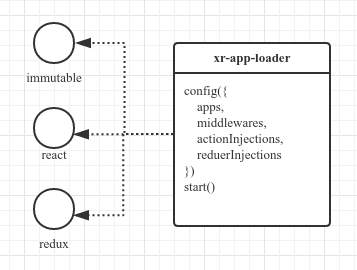
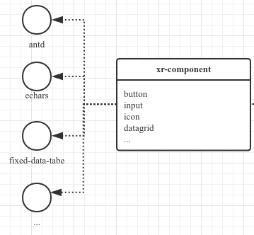
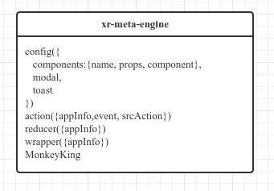
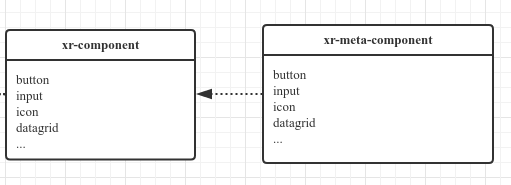
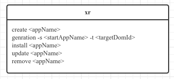
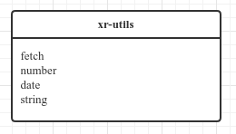
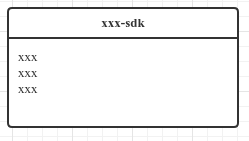
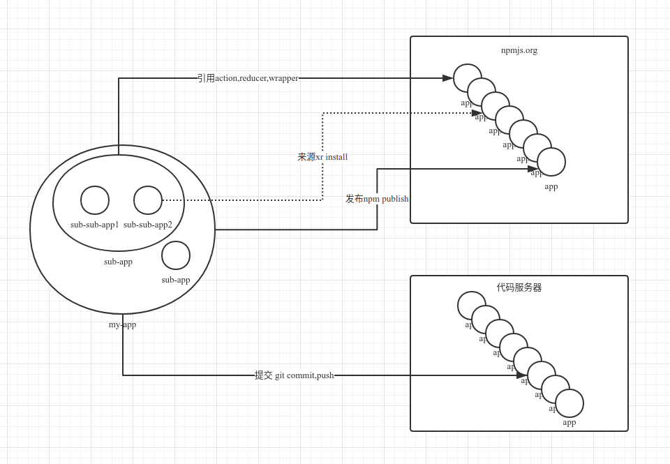

# xr

xr系列是一套整体的前端解决方案，分为以下几个部分

## xr-app-loader

应用加载器

- 基于react, redux, immutable
- 将前端页面拆分为独立职责的多个app
- 每个app能独立运行,有自己独立的状态
- 也可以组合运行
- 或者被其他app引用修改成为新的app

## xr-component

组件库

- 基于antd, echars, fixed-data-table
- 是一套纯组件库

## xr-meta-engine

界面元数据引擎

- 将前端界面使用json方式进行配置，交互事件也通过json配置
- 引擎初始化需要使用者注册元数据化组件库以及界面交互modal、消息提醒的组件
- 引擎提供action,reducer快速操作事件、状态、界面交互的方法

## xr-meta-component

元数据控件

- 基于xr-component
- 用于注册到元数据引擎使用
- 解析元数据为纯组件

## xr-tools

nodejs命令工具

- 支持快速搭建app脚手架
- 支持动态生成index.js文件
- 支持app内install、remove、update npmjs中的发布的app

## xr-utils

函数库

## xxx-sdk

后台sdk,如webpai

## 后续

- xr-nv-component
- xr-nv-meta-component

## 运行态

## 探讨主题

1.目前工作中觉得需要改进、框架支撑的内容

2.框架建议

